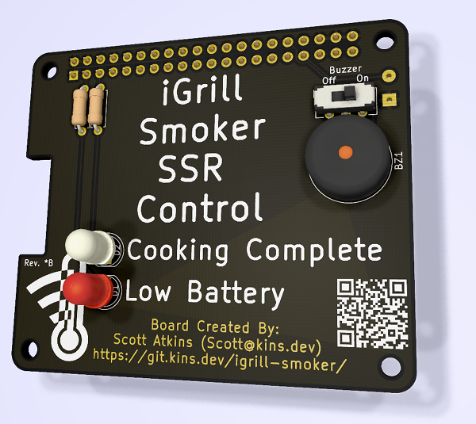
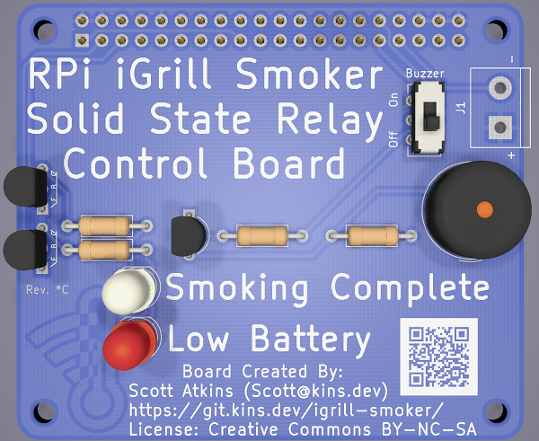
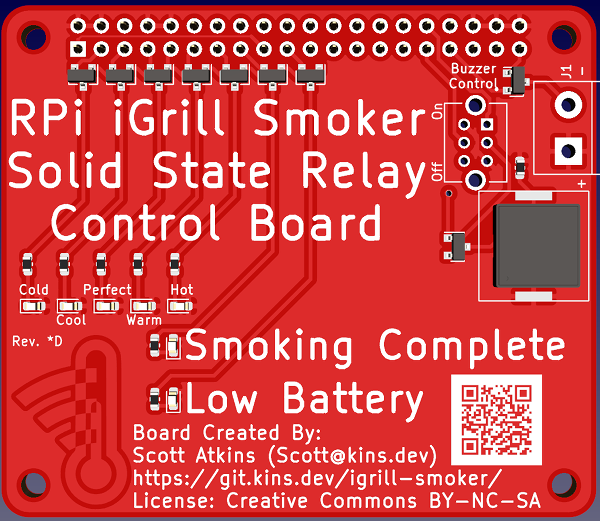
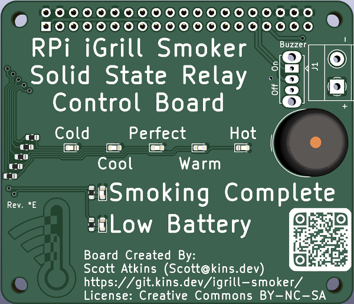
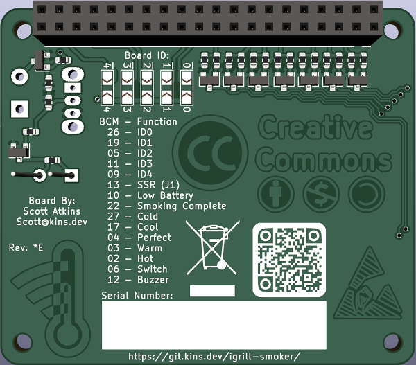

# Starting with Raspberry Pi Stretch [](https://travis-ci.org/kins-dev/igrill-smoker)

<!-- markdownlint-disable MD033 -->
**<span style="color:darkred">Note: You are 100% responsible for ensuring safe food practices are followed.  Check and modify temperatures as appropriate.</span>**
<!-- markdownlint-enable MD033 -->

<!-- markdownlint-disable MD033 -->
<h2>Table of Contents</h2>
<!-- markdownlint-enable MD033 -->
<!-- markdownlint-disable MD039 -->
<!-- @import "[TOC]" {cmd="toc" depthFrom=2 depthTo=6 orderedList=false} -->

<!-- code_chunk_output -->

- [Problem Statement](#problem-statement)
- [Design](#design)
- [Equipment](#equipment)
- [Requirements](#requirements)
- [Installation](#installation)
- [Software Setup](#software-setup)
- [Using iGrill Mini](#using-igrill-mini)
- [Grill Setup](#grill-setup)
- [Running](#running)
- [Lighttpd Setup](#lighttpd-setup)
- [Project Notes](#project-notes)
- [iGrill Smoker Board Rev. *A](#igrill-smoker-board-rev-a)
  - [*A Board](#a-board)
  - [*A Notes](#a-notes)
  - [*A Parts](#a-parts)
- [iGrill Smoker Board Rev. *B](#igrill-smoker-board-rev-b)
  - [*B Board](#b-board)
  - [*B Notes](#b-notes)
  - [*B Parts](#b-parts)
- [iGrill Smoker Board Rev. *C](#igrill-smoker-board-rev-c)
  - [*C Board](#c-board)
  - [*C Notes](#c-notes)
  - [*C Parts](#c-parts)
- [iGrill Smoker Board Rev. *D](#igrill-smoker-board-rev-d)
  - [*D Notes](#d-notes)
  - [*D Parts](#d-parts)
- [iGrill Smoker Board Rev. *E](#igrill-smoker-board-rev-e)
  - [*E Notes](#e-notes)
  - [*E Parts](#e-parts)

<!-- /code_chunk_output -->

<!-- markdownlint-enable MD039 -->
## Problem Statement

Create a low cost smoking unit that can be controlled/monitored via the internet.

## Design

See the [design document](documentation/iGrill_smoker_design.md).

## Equipment

Prices as of June 10th, 2019.  Some items like the hotplates or skillet can be found at Goodwill instead.  Total cost (new) $287.96.  Every item can be used for more than one task.  Meat, wood chips, and extension cords not included.

- [Weber Grill](https://www.amazon.com/Weber-741001-Original-22-Inch-Charcoal/dp/B00004RALU/ref=sr_1_3) - $109
- [iGrill2](https://www.amazon.com/Weber-7203-iGrill-2-Thermometer/dp/B01MG2CNDL/ref=sr_1_3) - $64.99
- [Hotplate](https://www.amazon.com/Cuisine-ESB-300X-Maxi-Matic-Single-Electric/dp/B0006A2ZTS/ref=sr_1_70) - 2x @ $12.96
- [TP-Link Kasa](https://www.amazon.com/TP-Link-HS100-Required-Google-Assistant/dp/B0178IC734/ref=sr_1_4) - $14.69
- [Raspberry Pi](https://www.target.com/p/raspberry-pi-3-model-b-project-board/-/A-53349740) - $34.49
- [SD Card](https://www.amazon.com/Kingston-Digital-microSDHC-SDC4-8GBSP/dp/B0027CA7UW/ref=sr_1_11) - $3.99
- [Skillets](https://www.amazon.com/dp/B073Q8P6C8/ref=psdc_289821_t1_B00008GKDN) - 2x @ $10.93
- [8 inch rings](https://www.amazon.com/Ateco-14408-8-Inch-Stainless-Cutter/dp/B002A5BU5M/ref=pd_sbs_79_5/140-6446357-6003018) - 2x @ $6.51

## Requirements

You must have:

- Raspberry Pi 3
- TP-Link Kasa
- iGrill2 or iGrill3 (iGrill mini coming soon for time based smoking)

Optional items:

- LEDs with current limiting resistors
- Speaker with 3.5 mm stereo jack input

*Note: This has been tested using a Raspberry Pi B 3 with Raspian Stretch.  Your milage may vary.*

This guide assumes you've done the basic setup of network and updated the system on your Raspberry Pi.  Remember, you probably want to enable ssh access.  You must have your iGrill ready to complete the installation and setup.  This does require python 3 to be installed.

## Installation

Either download and run ```auto-install.sh``` from the installation directory or run the following commands:

```bash
git clone https://git.kins.dev/igrill-smoker
cd igrill-smoker/install
bash run-install.sh
```

After starting the ```run-install.sh``` script, you should turn on your iGrill v2.  Installation shouldn't take long and the device is needed for setup.

## Software Setup

Copy ```config/iGrill_config.example.ini``` to ```config/iGrill_config.ini```.  Update ```iGrill_config.ini``` with any system settings you want to change.

Here is what that file looks like:
<!-- TODO: add > at the end of this line, open MPE, and use shift enter to regenerate --
```bash {cmd hide modify_source}
echo -n \`\`\`ini
cat config/iGrill_config.example.ini
echo -n \`\`\`
```
<!---->

<!-- code_chunk_output -->

```ini
# Copyright (c) 2019:   Scott Atkins <scott@kins.dev>
#                       (https://git.kins.dev/igrill-smoker)
# License:              MIT License
#                       See the LICENSE file
[iGrill]
# can be Standard or Mini
Type=Standard

[Probes]
# For iGrill mini set food probe to 0 and smoke probe to 1

# Food probe must be set between 0 and 4, where 0 means the
# probe is disabled.  The left most probe is 1 and right most
# is 4 on the iGrill 2/3
#
# If you disable the food probe, you must use a stage that
# is iGrill mini compatible (see stage file) or disable stages
FoodProbe=1

# Smoke probe must be set between 1 and 4.  The left most probe
# is 1 and right most is 4 on the iGrill 2/3
SmokeProbe=4

[Logging]
LogLevel=INFO
LogFile=

[Kasa]
# Name of your plug in the Kasa app, case sensitive
Name=iGrill-smoker

[Smoking]
MaxTempChange=2
TempBandSize=7

# Can be the name of any file in the stages directory (excluding the .sh) or None
Food=brisket

# Only valid if Food=None
SmokeMid=225
InternalTarget=185

[Reporting]
# time in seconds between polls of the iGrill
# faster polling means more power use
PollTime=20

ResultsDirectory=/var/www/html
CSVFile=current.csv
StateFile=state.json
```

<!-- /code_chunk_output -->

Edit the chart.html file in the website_example directory to suit your needs and copy it to your ```/var/www/html``` directory.

## Using iGrill Mini

The iGrill mini has a single probe.  That means you can either monitor the smoke temperature or the food temperature.  Since this is controlling a plug for the smoke, you should not monitor the food temperature via the iGrill mini probe.  Follow the instructions in iGrill_config.example.ini for setting the probe values.

## Grill Setup

## Running

Start a smoking session by running:

```bash
./start_smoking.sh
```

## Lighttpd Setup

Secure your instance of lighttpd using the instructions at <https://github.com/galeone/letsencrypt-lighttpd/blob/master/renew.sh>.  You may want a wildcard certificate and you can find instructions via <https://asknetsec.com/generate-lets-encrypt-free-wildcard-certificate-using-certbot-ubuntu-16-04/>.  Check your SSL setup via <https://www.ssllabs.com/ssltest/index.html>.

Also, it may be a good idea to setup lighttpd such that ```*.csv```/```*.json``` is not cached.  Here's an example lighttpd config file:

```ruby
server.modules = (
        "mod_expire",
        "mod_access",
        "mod_alias",
        "mod_compress",
        "mod_redirect",
        "mod_setenv",
        "mod_dirlisting",
)

server.document-root                            = "/var/www/html"
server.upload-dirs                              = ( "/var/cache/lighttpd/uploads" )
server.errorlog                                 = "/var/log/lighttpd/error.log"
server.pid-file                                 = "/var/run/lighttpd.pid"
server.username                                 = "www-data"
server.groupname                                = "www-data"
server.port                                     = 80

index-file.names                                = ( "index.php", "index.html", "index.lighttpd.html" )
url.access-deny                                 = ( "~", ".inc" )
static-file.exclude-extensions                  = ( ".php", ".pl", ".fcgi" )

compress.cache-dir                              = "/var/cache/lighttpd/compress/"
compress.filetype                               = ( "application/javascript", "text/css", "text/html", "text/plain" )

# default listening port for IPv6 falls back to the IPv4 port
## Use ipv6 if available
#include_shell "/usr/share/lighttpd/use-ipv6.pl " + server.port
include_shell "/usr/share/lighttpd/create-mime.assign.pl"
include_shell "/usr/share/lighttpd/include-conf-enabled.pl"

# SSL Config
$SERVER["socket"] == ":443" {
        protocol                                = "https://"
        ssl.engine                              = "enable"
        ssl.ca-file                             = "/etc/lighttpd/fullchain.pem"
        ssl.pemfile                             = "/etc/lighttpd/wildcard.cert.pem"

        setenv.add-environment  = (
                "HTTPS"                         => "on"
        )

        setenv.add-response-header  = (
                # Allow cross domain access
                # Safari requires *
                "Access-Control-Allow-Origin"   => "*",

                # Used to identify the server based on headers
                "Server"                        => "Server name",

                # Set timeout for ssl access
                "Strict-Transport-Security"     => "max-age=15768000;"
        )

        # Mitigate BEAST attack:
        #
        # A stricter base cipher suite. For details see:
        # http://blog.ivanristic.com/2011/10/mitigating-the-beast-attack-on-tls.html
        ssl.cipher-list                         = "ECDHE-ECDSA-AES256-GCM-SHA384:ECDHE-RSA-AES256-GCM-SHA384:ECDHE-ECDSA-CHACHA20-POLY1305:ECDHE-RSA-CHACHA20-POLY1305:ECDHE-ECDSA-AES128-GCM-SHA256:ECDHE-RSA-AES128-GCM-SHA256:ECDHE-ECDSA-AES256-SHA384:ECDHE-RSA-AES256-SHA384:ECDHE-ECDSA-AES128-SHA256:ECDHE-RSA-AES128-SHA256"

        # Make the server prefer the order of the server side cipher suite instead of the client suite.
        # This is necessary to mitigate the BEAST attack (unless you disable all non RC4 algorithms).
        # This option is enabled by default, but only used if ssl.cipher-list is set.
        ssl.honor-cipher-order                  = "enable"

        # Mitigate CVE-2009-3555 by disabling client triggered renegotiation
        # This is enabled by default.
        ssl.disable-client-renegotiation        = "enable"
        ssl.ec-curve                            = "secp384r1"
        ssl.use-compression                     = "disable"

        # Disable SSLv2 because is insecure
        ssl.use-sslv2                           = "disable"

        # Disable SSLv3 (can break compatibility with some old browser) /cares
        ssl.use-sslv3                           = "disable"
}

# Prevent caching of json/csv files
$HTTP["url"] =~ "/.*\.(json|csv)$" {
        expire.url = (
                ""                              => "access 0 seconds",
        )
}
```

## Project Notes

1.3 Uses TP-Link Kasa for power control.  1.4 includes a brand new power control board that plugs into the Raspberry Pi which will allow much more fine grain control of the smoker temperature.

This is necessary because the relay in the TP-Link won't handle the number of on/off cycles required.  Instead a solid state relay is used.  A word of caution, this is not UL rated or certified.  If you don't know which end of the soldering iron to hold, then you probably should just stick with 1.3.

The TP-Link Kasa plug will still be used as a failsafe device in the system.

## iGrill Smoker Board Rev. *A

### *A Board


This board has a buzzer, two LEDs and connection points for the solid state relay.  It sits off the edge of the Raspberry Pi GPIOs.

### *A Notes

This board should not be used.

Features

- Two LEDs
- Buzzer
- Small design

Defects

- The spacing for the resistors is off
- Hard to hand solder
- Hangs off the board the wrong way
- Red LED stays on due to leakage current
- Leakage current to the SSR

### *A Parts

- Header (2x20): [DigiKey](https://www.digikey.com/product-detail/en/sullins-connector-solutions/SFH11-PBPC-D20-ST-BK/S9200-ND/1990093) $1.94
- LED (Green): [DigiKey](https://www.digikey.com/product-detail/en/lite-on-inc/LTL-4233/160-1130-ND/217580) $0.36
- LED (Red): [DigiKey](https://www.digikey.com/product-detail/en/wurth-electronics-inc/151051RS11000/732-5016-ND/4490012) $0.15
- Resistors (100 ohm x2): [DigiKey](https://www.digikey.com/product-detail/en/stackpole-electronics-inc/CF14JT100R/CF14JT100RCT-ND/1830327) $0.10
- Buzzer: [DigiKey](https://www.digikey.com/product-detail/en/tdk-corporation/PS1240P02BT/445-2525-1-ND/935930) $0.68

## iGrill Smoker Board Rev. *B

### *B Board



This board has a buzzer, two LEDs and connection points for the solid state relay.  It sits on the Raspberry Pi GPIOs.

### *B Notes

This board should not be used.

New Features

- Sits over the Pi with mounting holes
- Board auto detect works
- Buzzer switch

Defects

- The spacing for the resistors is off
- The QR code doesn't always read correctly
- The solder mask makes it hard to read the @ symbol
- Red LED stays on due to leakage current
- Buzzer makes a sound when it shouldn't
- Leakage current to the SSR

### *B Parts

- Header (2x20): [DigiKey](https://www.digikey.com/product-detail/en/sullins-connector-solutions/SFH11-PBPC-D20-ST-BK/S9200-ND/1990093) $1.94
- LED (Green): [DigiKey](https://www.digikey.com/product-detail/en/lite-on-inc/LTL-4233/160-1130-ND/217580) $0.36
- LED (Red): [DigiKey](https://www.digikey.com/product-detail/en/wurth-electronics-inc/151051RS11000/732-5016-ND/4490012) $0.15
- Resistors (100 ohm x2): [DigiKey](https://www.digikey.com/product-detail/en/stackpole-electronics-inc/CF14JT100R/CF14JT100RCT-ND/1830327) $0.10
- Buzzer: [DigiKey](https://www.digikey.com/product-detail/en/tdk-corporation/PS1240P02BT/445-2525-1-ND/935930) $0.68
- Switch: [DigiKey](https://www.digikey.com/product-detail/en/c-k-components/JS202011CQN/401-2001-ND/1640097) $0.43

## iGrill Smoker Board Rev. *C

### *C Board



This board has a buzzer, two LEDs and a terminal block for the solid state relay.  It sits on the Raspberry Pi GPIOs.

### *C Notes

This board is currently in production and has not been tested.

New Features

- NPN transistors to remove leakage

Fixes

- QR Code
- Resistor spacing
- Solder mask changed to silk screen for fine pitch
- Using suggested design for the buzzer

Defects

- Leakage current to the SSR
- Missing resistors on NPN transistor base (good design practice)

### *C Parts

- Header (2x20): [DigiKey](https://www.digikey.com/product-detail/en/sullins-connector-solutions/SFH11-PBPC-D20-ST-BK/S9200-ND/1990093) $1.94
- LED (Green): [DigiKey](https://www.digikey.com/product-detail/en/lite-on-inc/LTL-4233/160-1130-ND/217580) $0.36
- LED (Red): [DigiKey](https://www.digikey.com/product-detail/en/wurth-electronics-inc/151051RS11000/732-5016-ND/4490012) $0.15
- Resistors (100 ohm x3): [DigiKey](https://www.digikey.com/product-detail/en/stackpole-electronics-inc/CF14JT100R/CF14JT100RCT-ND/1830327) $0.10
- Buzzer: [DigiKey](https://www.digikey.com/product-detail/en/tdk-corporation/PS1240P02BT/445-2525-1-ND/935930) $0.68
- Switch: [DigiKey](https://www.digikey.com/product-detail/en/c-k-components/JS202011CQN/401-2001-ND/1640097) $0.43
- Transistors (NPN x3): [DigiKey](https://www.digikey.com/product-detail/en/micro-commercial-co/2N3904-AP/2N3904-APCT-ND/950591) $0.19

## iGrill Smoker Board Rev. *D



This board has a buzzer, seven LEDs and connection points for the solid state relay.  It sits on the Raspberry Pi GPIOs.

### *D Notes

The boards back from production are bad

New Features

- Five new LEDs for temperature monitoring
- Surface mount parts
- Mosfet transistors so a resistor is no longer needed
- Transistor to prevent SSR leakage
- Cheaper parts

Defects

- Silk screen issue
- QR Code issue (too small, inverted on back)
- Transistors wired backwards

### *D Parts

TODO: Add part list

## iGrill Smoker Board Rev. *E





This board has a buzzer, seven LEDs and connection points for the solid state relay.  It sits on the Raspberry Pi GPIOs.  It also has jumpers for a board id number

### *E Notes

This board is not yet in production and has not been tested.

New Features

- New QR code
- Pull down resistors for all transistors

Defects

- None found yet

### *E Parts

TODO: Add part list
